# Hi, I'm Han Qiao 👋

📍 **Singapore** | 🐘 **Backend Branching @ [Supabase](https://github.com/supabase)** | 🧪 **Postgres + agents**

Building Postgres-native infrastructure: agent harnesses, media processing, and remote execution — all inside the database.

## Start Here

- 🌍 **[OpenWorld](https://github.com/sweatybridge/OpenWorld)** - Postgres-resident agent harness for world, language, and vision models
- 🔌 **[supabase/mcp](https://github.com/supabase/mcp)** (2.9k+ stars) - connect Supabase to your AI assistants
- 🖥️ **[supabase/cli](https://github.com/supabase/cli)** (2.4k+ stars) - manage migrations, edge functions, and local Supabase
- 📸 **[pg_bager](https://github.com/sweatybridge/pg_bager)** - inline PNG/GIF in `psql` results
- 🎞️ **[pg_ffmpeg](https://github.com/sweatybridge/pg_ffmpeg)** - FFmpeg media processing inside Postgres
- 🔐 **[pg_ssh](https://github.com/sweatybridge/pg_ssh)** - run remote commands over SSH from inside Postgres

## Current Projects

### Agent Harness

- 🌍 **[OpenWorld](https://github.com/sweatybridge/OpenWorld)** - multiplayer agents in group chats; every turn runs as a durable Postgres workflow with replayable message rows

### Postgres Extensions

- 🔐 **[pg_ssh](https://github.com/sweatybridge/pg_ssh)** - one-shot exec, key generation, and pooled SSH transports from inside the database
- 🎞️ **[pg_ffmpeg](https://github.com/sweatybridge/pg_ffmpeg)** - `media_info`, `thumbnail`, and `transcode` for `bytea` media, built with [pgrx](https://github.com/pgcentralfoundation/pgrx)
- 📸 **[pg_bager](https://github.com/sweatybridge/pg_bager)** - a narrow `psql` pager filter that renders image-shaped `bytea` inline (Kitty, iTerm2, Sixel)

### Local Models

- 🧠 **[.llm](https://github.com/sweatybridge/.llm)** - config files for running models locally (llama.cpp + opencode, Qwen on 16GB VRAM)

## Older Projects

- 🔑 **[streamlit-supabase-auth](https://github.com/sweatybridge/streamlit-supabase-auth)** (60+ stars) - Streamlit login forms backed by Supabase OAuth
- 🎭 **[text-to-anime](https://github.com/sweatybridge/text-to-anime)** - convert text and audio to facial expressions

## GitHub Activity

## Connect

Random Facts

- Member of [Tetris-Duel-Team](https://github.com/Tetris-Duel-Team), creators of Tetris Duel
- Runs Qwen locally at ~45 tok/s on 16GB VRAM
- Powered by Singapore coffee

